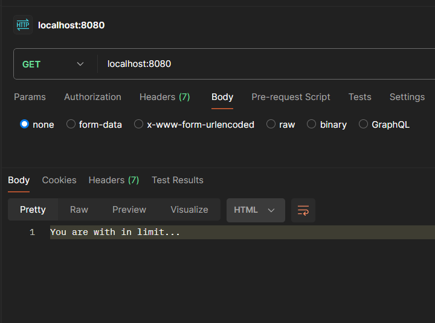
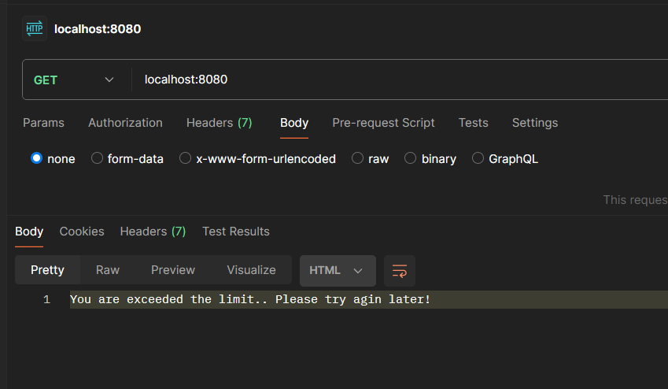

# Custom Rate Limiter
A custom rate-limiting technique built using Node.js without third-party libraries.
Every time a request is made, it stores the current timestamp and checks how many requests were made within the last fixed time window (for example, 1 minute). If the count exceeds the allowed limit, the request is blocked.

## What is Rate Limiting?
Rate limiting is a technique used to control the number of requests a client can make to your server in a given time window.
It’s essential to prevent abuse, protect server load, and ensure fair usage.

## Technologies Used:
- Node JS
- Express JS

## Note :
This implementation is for learning purposes only, intended to understand the basic mechanism behind rate limiting.
It is not scalable and not suitable for real-world production use, as it does not scale well.
Additionally, memory usage can grow indefinitely if stored timestamps are not properly cleaned up.

## Steps to run the service:

- Make sure Node JS installed in your system.
- Clone the repo using `git clone https://github.com/VengadeshRaj/custom-rate-limiter.git`.
- Go inside the root folder.
- Run `npm i` to install all the dependencies.
- Run `npm run dev` to run the service locally.

### Example:
You can able to hit the endpoint 5 times in a 1 minute window.

If you are within the limit:

If you exceed the limit
